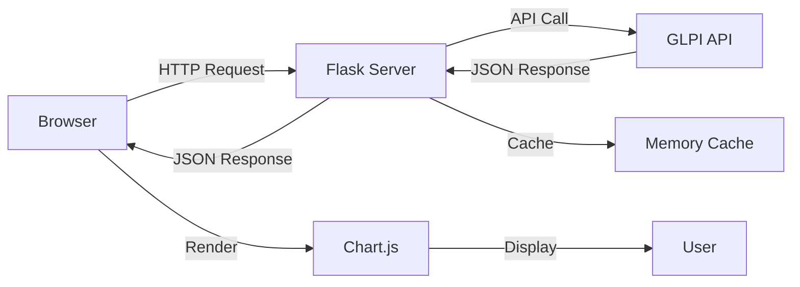

# SLA Compliance Dashboard

Modern, web-based SLA compliance monitoring dashboard for GLPI with interactive charts and real-time data visualization.


## 📸 Screenshots

### Light Mode
Beautiful glassmorphism design with vibrant gradients and smooth animations.

### Dark Mode
Eye-friendly dark theme with optimized colors and contrast.

## ✨ Features

### 🎨 Modern UI/UX
- **Glassmorphism Design**: Frosted glass effect with backdrop blur
- **Dark Mode**: Seamless theme switching with localStorage persistence
- **Responsive Layout**: Optimized for mobile, tablet, and desktop
- **Smooth Animations**: Hover effects, transitions, and micro-interactions
- **Custom Scrollbars**: Themed scrollbar styling

### 📊 Interactive Visualizations
- **SLA Compliance Pie Chart**: Overall compliance vs violations
- **Top Violations Bar Chart**: Top 10 entities with most violations
- **Entity Breakdown Chart**: Stacked horizontal bar showing compliance by entity
- **Real-time Updates**: Refresh data with a single click

### 🔧 Advanced Controls
- **Date Range Picker**: Select custom start and end dates
- **Entity Filter**: Focus on specific entities or view all
- **Quick Actions**: Load data, refresh, export to CSV
- **Loading States**: Visual feedback during data fetching

### 📈 Summary Cards (KPIs)
- Total Tickets (All)
- SLA Tickets (Total with TTR/TTO)
- Active (Within SLA) Count
- SLA Compliant Count
- SLA Violated Count
- Overall Compliance Rate (%)

### 📋 Detailed Data Table
- Recent SLA violations (up to 100)
- Sortable and filterable columns
- Entity, Ticket ID, Name, Date, Violation Type, SLA Name
- Hover effects for better readability

## 🚀 Quick Start

### Prerequisites

- Python 3.8 or higher
- GLPI instance with API access
- Valid GLPI API tokens (App Token and User Token)

### Installation

1. **Clone or navigate to the project directory:**
```bash
cd "c:\Users\Super\Desktop\ITSM - GLPI\Script\reports_sla"
```

2. **Install Python dependencies:**
```bash
pip install -r requirements.txt
```

3. **Configure GLPI connection:**

Ensure your `config.json` file exists in one of these locations:
- `./config.json`
- `../config/config.json`
- `../../config/config.json`

Example `config.json`:
```json
{
  "GLPI_URL": "https://your-glpi-instance.com/apirest.php",
  "GLPI_APP_TOKEN": "your_app_token_here",
  "GLPI_USER_TOKEN": "your_user_token_here"
}
```

### Running the Dashboard

**Start the Flask server:**
```bash
python sla_dashboard_api.py
```

You should see:
```
============================================================
SLA Compliance Dashboard API
============================================================
Dashboard: http://localhost:5000
API Endpoints:
  - GET /api/entities
  - GET /api/compliance-data?start_date=YYYY-MM-DD&end_date=YYYY-MM-DD
  - GET /api/export/csv?start_date=YYYY-MM-DD&end_date=YYYY-MM-DD
============================================================
 * Running on http://127.0.0.1:5000
```

**Open in your browser:**
```
http://localhost:5000
```

## 📖 Usage Guide

### Loading Data

1. **Select Date Range**: 
   - Click on "Start Date" and choose the beginning of your reporting period
   - Click on "End Date" and choose the end of your reporting period
   - Default: Last 30 days

2. **Filter by Entity (Optional)**:
   - Use the "Entity Filter" dropdown to select a specific entity
   - Leave as "All Entities" to view all data

3. **Load Data**:
   - Click the "Load Data" button
   - Wait for the loading spinner to complete
   - Dashboard will populate with charts and data

### Interacting with Charts

- **Hover**: See detailed values for each data point
- **Legend**: Click legend items to show/hide data series
- **Responsive**: Charts automatically resize with window

### Exporting Data

Click the "Export CSV" button to download a CSV file with:
- Entity name
- Total tickets
- SLA compliant count
- SLA violated count
- Violation rate percentage

### Switching Themes

Click the moon/sun icon in the top right to toggle between light and dark modes. Your preference is saved automatically.

### Refreshing Data

Click the refresh icon (circular arrows) to reload data with current filters.

## 🏗️ Architecture

### Backend (Flask API)

**File**: `sla_dashboard_api.py`

**Technology Stack**:
- Flask 3.0.0 - Web framework
- Flask-CORS 4.0.0 - Cross-origin resource sharing
- Requests 2.31.0 - HTTP client for GLPI API
- urllib3 2.1.0 - HTTP library

**Key Features**:
- RESTful API design
- 5-minute caching for improved performance
- Session management with GLPI API
- Comprehensive error handling
- CORS support for API access

**API Endpoints**:

| Endpoint | Method | Description |
|----------|--------|-------------|
| `/` | GET | Serve dashboard HTML |
| `/dashboard.css` | GET | Serve CSS file |
| `/dashboard.js` | GET | Serve JavaScript file |
| `/api/entities` | GET | Fetch all GLPI entities |
| `/api/compliance-data` | GET | Get SLA compliance data |
| `/api/export/csv` | GET | Export data to CSV |

**Example API Calls**:

```bash
# Get all entities
curl http://localhost:5000/api/entities

# Get compliance data for date range
curl "http://localhost:5000/api/compliance-data?start_date=2024-01-01&end_date=2024-12-31"

# Get compliance data for specific entity
curl "http://localhost:5000/api/compliance-data?start_date=2024-01-01&end_date=2024-12-31&entity_id=17"

# Export to CSV
curl "http://localhost:5000/api/export/csv?start_date=2024-01-01&end_date=2024-12-31" -o report.csv
```

### Frontend

**Files**:
- `dashboard.html` - HTML structure (230 lines)
- `dashboard.css` - Styling (450 lines)
- `dashboard.js` - JavaScript logic (550 lines)

**Technology Stack**:
- HTML5 - Semantic markup
- CSS3 - Modern features (variables, grid, flexbox, backdrop-filter)
- Vanilla JavaScript - No framework dependencies
- Chart.js 4.4.1 - Interactive charts
- Date-fns 3.0.0 - Date manipulation

**Design Principles**:
- Mobile-first responsive design
- Accessibility (ARIA labels, semantic HTML)
- Performance optimization (lazy loading, minimal bundle)
- Progressive enhancement

## 🎨 Customization

### Changing Colors

Edit `dashboard.css` and modify CSS variables:

```css
:root {
    --color-primary: #6366f1;        /* Primary brand color */
    --color-secondary: #8b5cf6;      /* Secondary color */
    --color-success: #10b981;        /* Success/compliant color */
    --color-danger: #ef4444;         /* Danger/violation color */
    --gradient-primary: linear-gradient(135deg, #667eea 0%, #764ba2 100%);
}
```

### Adding New Charts

1. Add a canvas element in `dashboard.html`:
```html
<canvas id="myNewChart"></canvas>
```

2. Create the chart in `dashboard.js`:
```javascript
const myChart = new Chart(ctx, {
    type: 'bar',
    data: {...},
    options: {...}
});
```

### Modifying API Endpoints

Edit `sla_dashboard_api.py` and add new routes:

```python
@app.route('/api/my-endpoint')
def my_endpoint():
    # Your logic here
    return jsonify({'data': 'value'})
```

## 🔧 Configuration

### Cache Settings

Modify cache TTL in `sla_dashboard_api.py`:

```python
CACHE_TTL = 300  # 5 minutes (in seconds)
```

### Server Settings

Change host and port:

```python
app.run(debug=True, host='0.0.0.0', port=5000)
```

For production, use a WSGI server like Gunicorn:

```bash
pip install gunicorn
gunicorn -w 4 -b 0.0.0.0:5000 sla_dashboard_api:app
```

## 📊 Data Flow



## 🐛 Troubleshooting

### Dashboard Not Loading

**Problem**: Page shows "Loading data..." indefinitely

**Solutions**:
1. Check if Flask server is running
2. Open browser console (F12) and check for errors
3. Verify `dashboard.css` and `dashboard.js` are loading (Network tab)
4. Ensure GLPI API is accessible

### API Connection Errors

**Problem**: "Failed to load data" notification

**Solutions**:
1. Verify `config.json` exists and has correct credentials
2. Test GLPI API manually:
   ```bash
   curl -X GET "https://your-glpi.com/apirest.php/initSession" \
     -H "Authorization: user_token YOUR_TOKEN" \
     -H "App-Token: YOUR_APP_TOKEN"
   ```
3. Check GLPI API is enabled and accessible
4. Verify SSL certificate (or disable SSL verification for testing)

### Charts Not Rendering

**Problem**: Chart areas are empty

**Solutions**:
1. Ensure data is loaded (check browser console)
2. Verify Chart.js CDN is accessible
3. Check for JavaScript errors in console
4. Try refreshing the page

### Dark Mode Not Working

**Problem**: Theme doesn't switch

**Solutions**:
1. Clear browser localStorage
2. Check browser console for errors
3. Verify `dashboard.js` is loaded correctly

### CSV Export Fails

**Problem**: Export button doesn't download file

**Solutions**:
1. Check if date range is selected
2. Verify Flask server is running
3. Check browser's download settings
4. Look for errors in browser console

## 🔒 Security Considerations

### Production Deployment

1. **Disable Debug Mode**:
```python
app.run(debug=False, host='0.0.0.0', port=5000)
```

2. **Use HTTPS**: Deploy behind a reverse proxy (nginx, Apache)

3. **Secure API Tokens**: Use environment variables instead of config files:
```python
import os
GLPI_USER_TOKEN = os.environ.get('GLPI_USER_TOKEN')
```

4. **Add Authentication**: Implement user login for dashboard access

5. **Rate Limiting**: Add rate limiting to prevent abuse:
```bash
pip install flask-limiter
```

6. **CORS Configuration**: Restrict allowed origins in production:
```python
CORS(app, resources={r"/api/*": {"origins": "https://yourdomain.com"}})
```

## 📈 Performance Tips

### Optimize Data Loading

1. **Adjust Cache TTL**: Increase for less frequent updates
2. **Limit Date Range**: Shorter ranges load faster
3. **Use Entity Filter**: Filter data on backend, not frontend
4. **Pagination**: Implement pagination for large datasets

### Frontend Optimization

1. **Lazy Load Charts**: Only create charts when data is available
2. **Debounce Events**: Prevent excessive API calls
3. **Minimize Redraws**: Update charts efficiently
4. **Use CDN**: Serve static assets from CDN

## 🤝 Contributing

Contributions are welcome! To contribute:

1. Fork the repository
2. Create a feature branch
3. Make your changes
4. Test thoroughly
5. Submit a pull request

## 📝 License

This project is licensed under the MIT License.

## 🙏 Acknowledgments

- **Chart.js**: Beautiful, responsive charts
- **Flask**: Lightweight web framework
- **GLPI**: Powerful IT asset management
- **Community**: Thanks to all contributors

## 📞 Support

For issues or questions:

1. Check this README
2. Review the main [README.md](README.md)
3. Check GLPI API documentation
4. Open an issue on the repository

## 🗺️ Roadmap

### Planned Features

- [ ] **Advanced Filters**: Category, priority, urgency filters
- [ ] **Trend Analysis**: Time-series charts showing SLA trends
- [ ] **Notifications**: Email alerts for SLA violations
- [ ] **User Management**: Multi-user support with roles
- [ ] **Custom Reports**: Build custom report templates
- [ ] **PDF Export**: Generate PDF reports with charts
- [ ] **Mobile App**: Progressive Web App (PWA) support
- [ ] **Real-time Updates**: WebSocket support for live data
- [ ] **Predictive Analytics**: ML-based SLA violation prediction
- [ ] **Multi-language**: i18n support for multiple languages

---

**Version**: 3.1  
**Last Updated**: 12 Ocak 2026  
**Author**: Bora Ergül  

**Quick Links**:
- [Main README](README.md)
- [GLPI Documentation](https://glpi-project.org/documentation/)
- [Chart.js Documentation](https://www.chartjs.org/docs/)
- [Flask Documentation](https://flask.palletsprojects.com/)
